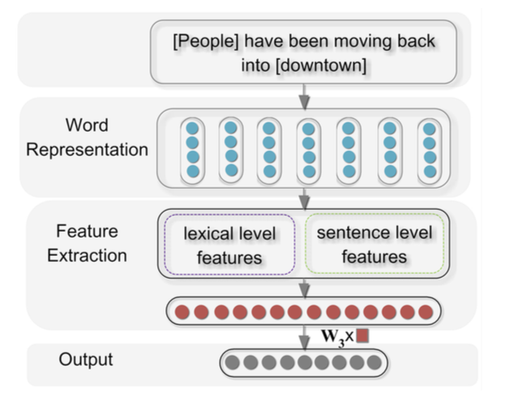

# Relation Classification via Convolutional Deep Neural Network

This is an implementation of paper [Relation Classification via Convolutional Deep Neural Network](http://www.aclweb.org/anthology/C14-1220) in PyTorch

## Model



## Environment

* Python 3.6+
* PyTorch 1.1.0

## Data

1. 'Cause-Effect' 1003
2. 'Instrument-Agency' 504
3. 'Product-Producer' 717
4. 'Entity-Origin' 716
5. 'Theme-Tool' 0
6. 'Component-Whole' 941
7. 'Content-Container' 540
8. 'Other' 1410

## Usage

Data preprocess

```bash
python process.py --in_filename=ARGS --out_filename=ARGS
```

Training

```bash
python main.py --train_filename data/2010/merge_bin_2010/train/train-1 --test_filename data/2010/merge_bin_2010/test/test-1
python main.py --train_filename data/2010/merge_bin_2010/train/train-2 --test_filename data/2010/merge_bin_2010/test/test-2
python main.py --train_filename data/2010/merge_bin_2010/train/train-3 --test_filename data/2010/merge_bin_2010/test/test-3
python main.py --train_filename data/2010/merge_bin_2010/train/train-4 --test_filename data/2010/merge_bin_2010/test/test-4
python main.py --train_filename data/2010/merge_bin_2010/train/train-5 --test_filename data/2010/merge_bin_2010/test/test-5
python main.py --train_filename data/2010/merge_bin_2010/train/train-6 --test_filename data/2010/merge_bin_2010/test/test-6
python main.py --train_filename data/2010/merge_bin_2010/train/train-7 --test_filename data/2010/merge_bin_2010/test/test-7

python main.py data/2010/split_bin_2010/train-1 --test_filename data/2010/merge_bin_2010/test/test-
```

## Result

Accuracy
67.84%